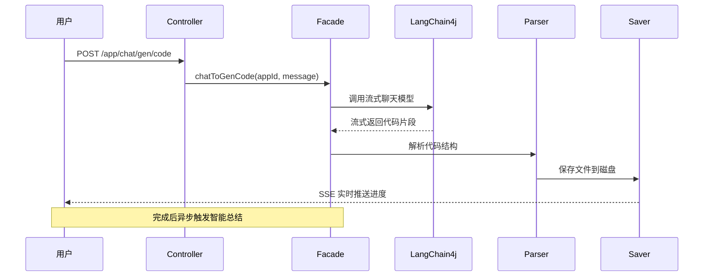
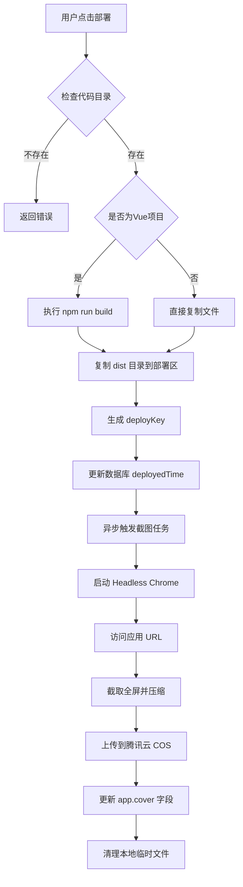
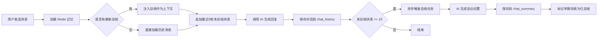
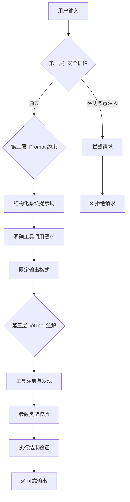

# Maiko AI Code Mother

> 🚀 **AI 驱动的全栈应用智能生成平台** - 从自然语言到完整 Vue 项目的零代码开发体验
> 
> 用户只需用自然语言描述需求,AI 即可流式生成完整的 **Vue 3 + Vite** 前端项目,并支持一键部署、自动截图、智能记忆管理等企业级功能。

---

## ✨ 核心特性

### 🎯 AI 代码生成
- **流式输出**: 基于 SSE (Server-Sent Events) 实现打字机效果的实时代码生成
- **多模式支持**: 
  - 🔹 HTML 单文件模式 (CSS + JS 内联)
  - 🔹 多文件模式 (index.html + style.css + script.js)
  - 🔹 **Vue 工程模式** (Vue 3 + Vite + 组件化架构) ⭐ NEW
- **智能工具调用**: AI 可自主读写文件、创建目录、删除文件,实现真正的自动化开发
- **代码质量检查**: 内置 AI 代码审查节点,确保生成代码符合最佳实践

### 🌐 应用全生命周期管理
- **一键部署**: 自动生成 deployKey,将代码部署为可访问的静态网站
- **自动截图**: 部署后异步生成应用封面图,上传至腾讯云 COS
- **封面兜底机制**: 默认封面保障前端永不出现裂图 ⭐ NEW
- **资源清理**: 删除应用时同步清理云端封面文件,定时清理本地临时文件 ⭐ NEW
- **代码下载**: 智能过滤冗余文件(node_modules/.git等),打包为 ZIP 供用户下载

### 💬 智能对话系统
- **上下文记忆**: 基于 Redis 持久化每个应用的独立对话历史
- **智能总结**: 达到 10 轮对话后,异步触发 AI 生成"会议纪要式"总结,压缩 Token 消耗
- **游标分页**: 高效查询历史对话记录
- **导出功能**: 支持导出对话为 Markdown 文件(含时间范围筛选)

### 👥 完善的用户体系
- **多种登录方式**:
  - 📧 账号密码注册/登录 (MD5+Salt 加密)
  - 📱 手机号验证码登录 (60s 频率限制)
  - 💬 微信公众号 OAuth2.0 登录
- **角色权限**: user / admin / vip / editor / partner / ban
- **Session 管理**: Redis 持久化,30 天有效期
- **AOP 权限拦截**: 基于 `@AuthCheck` 注解的细粒度权限控制

### 🛡️ 企业级特性
- **LangGraph4j 工作流**: 可视化编排复杂的 AI Agent 工作流
- **并发图像收集**: 并行收集 Logo/插图/图表等多类型资源
- **提示词安全护栏**: 输入输出双重校验,防止恶意注入
- **监控告警**: Prometheus + Actuator 实时监控
- **API 文档**: Knife4j (OpenAPI 3) 自动生成接口文档

---

## 🏗️ 技术栈

| 分类 | 技术 | 版本 |
|------|------|------|
| **核心框架** | Spring Boot | 3.5.13 |
| **Java 版本** | Java | 21 (虚拟线程) |
| **ORM 框架** | MyBatis-Flex | 1.11.0 |
| **数据库** | MySQL | 8.x |
| **缓存** | Redis + Caffeine | - |
| **AI 框架** | LangChain4j | 1.1.0 |
| **工作流引擎** | LangGraph4j | 1.6.0-rc2 |
| **AI 模型** | DeepSeek Chat / Qwen | - |
| **流式输出** | LangChain4j Reactor (SSE) | 1.1.0-beta7 |
| **记忆存储** | LangChain4j Community Redis | 1.1.0-beta7 |
| **Session 管理** | Spring Session Data Redis | - |
| **微信 SDK** | WxJava (weixin-java-mp) | 4.6.0 |
| **API 文档** | Knife4j (OpenAPI 3) | 4.4.0 |
| **对象存储** | 腾讯云 COS SDK | 5.6.227 |
| **网页截图** | Selenium + WebDriverManager | 4.33.0 / 6.1.0 |
| **工具库** | Hutool | 5.8.38 |
| **分布式锁** | Redisson | 3.50.0 |
| **监控** | Micrometer + Prometheus | - |

---

## 📂 项目结构

```
src/main/java/com/maiko/maikoaicodemother/
├── ai/                        # AI 服务层
│   ├── AiCodeGeneratorService.java        # AI 代码生成接口
│   ├── AiCodeGeneratorServiceFactory.java # 工厂模式 + Caffeine 缓存
│   ├── ChatSummaryAiService.java          # 对话总结 AI 服务
│   ├── tools/                             # AI 工具集 (FileRead/Write/Delete/Modify)
│   └── guardrail/                         # 安全护栏 (输入输出校验)
├── aop/                       # AOP 切面
│   └── AuthInterceptor.java               # 权限拦截器
├── config/                    # 配置类
│   ├── CorsConfig.java                    # 跨域配置
│   ├── RedisConfig.java                   # Redis 序列化配置
│   ├── CosClientConfig.java               # 腾讯云 COS 配置
│   ├── RoutingAiModelConfig.java          # AI 模型路由配置
│   └── WxMpConfiguration.java            # 微信公众号配置
├── controller/                # 控制层
│   ├── AppController.java                 # 应用管理 (CRUD/部署/下载/截图)
│   ├── ChatHistoryController.java         # 对话历史管理
│   ├── UserController.java                # 用户管理 (注册/登录/权限)
│   └── StaticResourceController.java     # 静态资源访问 (已部署应用)
├── core/                      # 核心业务逻辑
│   ├── AiCodeGeneratorFacade.java         # 门面模式:统一代码生成入口
│   ├── builder/VueProjectBuilder.java     # Vue 项目构建器 (npm install/build)
│   ├── parser/                            # 策略模式:代码解析器
│   ├── saver/                             # 模板方法:代码文件保存器
│   └── handler/                           # 流式消息处理器
├── langgraph4j/               # LangGraph 工作流 ⭐ NEW
│   ├── CodeGenWorkflow.java               # 主工作流 (Prompt增强→代码生成→质量检查)
│   ├── node/                              # 工作流节点
│   │   ├── PromptEnhancerNode.java        # 提示词优化节点
│   │   ├── CodeGeneratorNode.java         # 代码生成节点
│   │   ├── CodeQualityCheckNode.java      # 代码质量检查节点
│   │   └── ImageCollectorNode.java        # 图像资源收集节点
│   └── state/WorkflowContext.java         # 工作流上下文状态
├── manager/                   # 第三方服务管理器
│   ├── CosManager.java                    # COS 对象存储管理 (上传/删除)
│   └── WxMpServiceManager.java           # 微信服务管理
├── service/                   # 业务服务层
│   ├── impl/AppServiceImpl.java           # 应用服务 (含截图/部署/清理逻辑)
│   ├── impl/ScreenshotServiceImpl.java    # 截图服务 (Selenium + COS)
│   └── impl/ProjectDownloadServiceImpl.java # 项目下载服务 (ZIP 打包)
├── task/                      # 定时任务 ⭐ NEW
│   └── FileCleanupTask.java               # 本地临时文件清理任务
├── model/                     # 数据模型
│   ├── entity/                            # 实体类 (App/User/ChatHistory/ChatSummary)
│   ├── dto/                               # 请求 DTO
│   ├── vo/                                # 响应 VO
│   └── enums/                             # 枚举类
└── mapper/                    # MyBatis-Flex Mapper
```

---

## 🗄️ 数据库设计

### 快速初始化

```bash
mysql -u root -p < sql/create_table.sql
```

### 核心表说明

| 表名 | 说明 | 关键字段 |
|------|------|---------|
| `user` | 用户表 | id, username, password, phone, wxOpenId, userRole |
| `app` | 应用表 | id, appName, **cover**, codeGenType, **deployKey**, totalRounds, userId |
| `chat_history` | 对话历史表 | id, appId, messageType, content, isSummarized |
| `chat_summary` | 对话总结表 | id, appId, summaryContent, createdAt |

### 字段说明

**app 表新增字段**:
- `cover`: 应用封面图 URL (COS 地址或默认 `/images/Mango.png`)
- `deployKey`: 部署唯一标识 (6位随机字符串)
- `deployedTime`: 部署时间
- `totalRounds`: 对话总轮数

---

## 🚀 快速开始

### 1️⃣ 环境准备

| 工具 | 版本要求 | 说明 |
|------|---------|------|
| JDK | 21+ | 必须支持虚拟线程 |
| MySQL | 8.x | 关系型数据库 |
| Redis | 6.x+ | 缓存 + Session + AI 记忆 |
| Maven | 3.6+ | 项目构建 |
| Node.js | 18+ | Vue 项目构建 (可选) |
| Chrome | 最新版 | 网页截图 (自动下载驱动) |

### 2️⃣ 初始化数据库

```bash
# 执行建库建表脚本
mysql -u root -p < sql/create_table.sql

# 如需迁移旧库,按需执行
mysql -u root -p < sql/alter_table_add_login_fields.sql
mysql -u root -p < sql/alter_table_add_total_rounds.sql
mysql -u root -p < sql/alter_table_add_chat_summary.sql
```

### 3️⃣ 配置文件

#### 修改 `application.yml`

```yaml
spring:
  datasource:
    url: jdbc:mysql://localhost:3306/maiko_ai_code_mother?useUnicode=true&characterEncoding=utf-8&serverTimezone=Asia/Shanghai
    username: root
    password: 你的MySQL密码
  data:
    redis:
      host: localhost
      port: 6379
      password: 你的Redis密码 (如无密码留空)
```

#### 创建 `application-local.yml` (不提交到 Git)

```yaml
# AI 模型配置
langchain4j:
  open-ai:
    chat-model:
      base-url: https://api.deepseek.com
      api-key: sk-xxxxxxxxxxxxxxxxxxxx
      model-name: deepseek-chat
      max-tokens: 8192
      strict-json-schema: true
      response-format: json_object
    streaming-chat-model:
      base-url: https://api.deepseek.com
      api-key: sk-xxxxxxxxxxxxxxxxxxxx
      model-name: deepseek-chat
      max-tokens: 8192

# 腾讯云 COS 配置
cos:
  client:
    host: your-bucket.cos.ap-guangzhou.myqcloud.com
    secretId: AKIDxxxxxxxxxxxxxxxxxxxx
    secretKey: xxxxxxxxxxxxxxxxxxxx
    region: ap-guangzhou
    bucket: your-bucket

# 微信公众号配置 (可选)
wx:
  mp:
    app-id: your-wx-appid
    secret: your-wx-secret
```

> ⚠️ **安全提醒**: `application-local.yml` 包含敏感信息,已在 `.gitignore` 中排除,**严禁提交到公开仓库**。

### 4️⃣ 启动项目

```bash
# 编译并启动
mvn clean spring-boot:run

# 或使用 IDE 直接运行 MaikoAiCodeMotherApplication
```

服务启动后访问:
- **API 地址**: `http://localhost:8123/api`
- **API 文档**: `http://localhost:8123/api/doc.html`
- **健康检查**: `http://localhost:8123/api/health/`
- **监控指标**: `http://localhost:8123/api/actuator/prometheus`

---

## 📖 API 接口概览

接口前缀: `/api`

### 🔐 用户模块 `/user`

| 方法 | 路径 | 说明 | 权限 |
|------|------|------|------|
| POST | `/user/register` | 账号密码注册 | 无 |
| POST | `/user/login` | 账号密码登录 | 无 |
| POST | `/user/send/code` | 发送手机验证码 | 无 |
| POST | `/user/login/phone` | 手机号验证码登录 | 无 |
| POST | `/user/login/wx` | 微信公众号登录 | 无 |
| GET | `/user/get/login` | 获取当前登录用户 | 登录 |
| POST | `/user/logout` | 退出登录 | 登录 |
| POST | `/user/add` | 创建用户 | Admin |
| POST | `/user/delete` | 删除用户 | Admin |
| POST | `/user/update` | 更新用户 | Admin |
| GET | `/user/get` | 根据 ID 获取用户 | Admin |
| POST | `/user/list/page/vo` | 分页获取用户列表 | Admin |

### 📱 应用模块 `/app`

| 方法 | 路径 | 说明 | 权限 |
|------|------|------|------|
| POST | `/app/add` | 创建应用 | 登录 |
| POST | `/app/update` | 更新应用 | 本人 |
| POST | `/app/delete` | 删除应用 (含云端封面清理) | 本人/Admin |
| GET | `/app/get/vo` | 获取应用详情 (封面兜底) | 无 |
| POST | `/app/my/list/page/vo` | 获取我的应用列表 | 登录 |
| POST | `/app/good/list/page/vo` | 获取精选应用列表 | 无 |
| GET | `/app/chat/gen/code` | **AI 流式生成代码 (SSE)** | 登录 |
| POST | `/app/deploy` | **部署应用 + 自动截图** | 登录 |
| GET | `/app/download/{appId}` | **下载应用代码 (ZIP)** | 登录 |
| POST | `/app/admin/update` | 管理员更新应用 | Admin |
| POST | `/app/admin/delete` | 管理员删除应用 | Admin |
| POST | `/app/admin/list/page/vo` | 管理员查询应用列表 | Admin |
| GET | `/app/admin/get/vo` | 管理员获取应用详情 | Admin |

### 💬 对话历史模块 `/chatHistory`

| 方法 | 路径 | 说明 | 权限 |
|------|------|------|------|
| GET | `/chatHistory/app/{appId}` | 游标分页查询对话历史 | 登录 |
| POST | `/chatHistory/export` | 导出对话为 Markdown | 创建者/Admin |
| POST | `/chatHistory/admin/list/page/vo` | 管理员分页查询全部记录 | Admin |

### 🌐 其他接口

| 方法 | 路径 | 说明 |
|------|------|------|
| GET | `/health/` | 健康检查 |
| GET | `/static/{deployKey}/**` | 访问已部署的应用静态资源 |
| GET | `/images/Mango.png` | 默认封面图 |

---

## 🎯 核心功能详解

### 1. AI 代码生成流程



**关键特性**:
- ✅ **流式输出**: 用户可实时看到 AI "打字"过程
- ✅ **结构化解析**: 自动识别 HTML/CSS/JS 代码块
- ✅ **错误重试**: 输出护栏检测失败后自动重试
- ✅ **异步总结**: 达到阈值后后台生成会议纪要

### 2. 应用部署与自动截图



**优化点**:
- 🚀 **虚拟线程**: Java 21 虚拟线程处理异步截图,不阻塞主流程
- 🖼️ **封面兜底**: 截图失败或 cover 为空时返回 `/images/Mango.png`
- 🗑️ **资源清理**: 删除应用时同步删除 COS 文件 + 定时清理本地临时文件

### 3. 智能记忆管理



**优势**:
- 💰 **节省 Token**: 总结替代大量历史消息,减少 60-80% Token 消耗
- 🎯 **保持上下文**: 总结包含关键决策点,AI 不会"失忆"
- ⚡ **异步非阻塞**: 总结在后台执行,不影响用户体验

### 4. LangGraph4j 工作流 (高级特性)

项目集成了 LangGraph4j,支持可视化编排复杂 AI Agent 工作流:

**典型工作流**:
```
用户输入 → Prompt增强 → 代码生成 → 质量检查 → {通过? 保存 : 重试}
                                    ↓
                              图像资源收集 (并行)
                                    ↓
                              Logo + 插图 + 图表
                                    ↓
                              聚合结果 → 返回用户
```

**节点说明**:
- `PromptEnhancerNode`: 使用 AI 优化用户原始提示词
- `CodeGeneratorNode`: 调用大模型生成代码
- `CodeQualityCheckNode`: AI 审查代码规范/安全性
- `ImageCollectorNode`: 并行收集各类图像资源
- `RouterNode`: 根据条件路由到不同分支

---

## 🧠 AI 幻觉解决方案 (核心亮点)

> ⭐ **工具调用触发率实测 99.9%** - 通过 @Tool 注解 + Prompt 优化 + AI Service 配置三位一体方案解决幻觉问题

本项目采用**三层防御机制**彻底解决大模型幻觉问题,确保 AI 始终按预期行为执行。

### 🎯 幻觉问题的本质

大模型幻觉在代码生成场景中的典型表现:
- ❌ AI **凭空捏造**文件路径和内容,而不是真正写入磁盘
- ❌ AI **忘记调用工具**,直接在回复中输出代码片段
- ❌ AI **调用不存在的工具**或传错参数
- ❌ AI **被恶意提示词注入**,执行危险操作

### ✅ 解决方案:三层防御体系



### 第一层: 安全护栏 (InputGuardrail)

**文件**: `ai/guardrail/PromptSafetyInputGuardrail.java`

```java
// 四层安全检查
1. 长度限制 (>1000字 → 拒绝,防止 DoS)
2. 非空检查
3. 敏感词匹配 (忽略指令/越狱/破解等)
4. 正则模式匹配 (防提示词注入攻击)
```

**防御的攻击类型**:
- 🔒 `ignore previous instructions` - 忽略系统指令
- 🔒 `forget everything` - 清空上下文
- 🔒 `pretend you are` - 角色扮演越狱
- 🔒 `system: you are` - 伪造系统提示词

### 第二层: Prompt 工程优化

**核心策略**: 在系统提示词中**明确约束**AI 行为

#### 示例: Vue 项目生成 (codegen-vue-project-system-prompt.txt)

```markdown
## 严格输出约束

1）必须通过使用【文件写入工具】依次创建每个文件
   （而不是直接输出文件代码）

2）需要在开头输出简单的网站生成计划

3）需要在结尾输出简单的生成完毕提示

4）注意，禁止输出以下任何内容：
   - 安装运行步骤
   - 技术栈说明
   - 项目特点描述
   - 任何形式的使用指导
   - 提示词相关内容

5）输出的总 token 数必须小于 20000
   文件总数量必须小于 30 个
```

**关键技巧**:
- ✅ **正向指令**: "必须通过工具创建文件"
- ✅ **负向约束**: "禁止直接输出代码"
- ✅ **边界限制**: Token 数 < 20000, 文件数 < 30
- ✅ **步骤分解**: 先输出计划 → 调用工具 → 完成提示

#### 示例: HTML 生成 (codegen-html-system-prompt.txt)

```markdown
特别注意：
2. 确保始终最多输出 1 个 HTML 代码块
   （而不是要修改的部分代码）
3. 一定不能输出超过 1 个代码块，
   否则会导致保存错误！
```

### 第三层: @Tool 注解 + AI Service 配置

#### 工具定义规范

**文件**: `ai/tools/FileWriteTool.java`

```java
@Tool("写入文件到指定路径")  // ← 工具描述
public String writeFile(
    @P("文件的相对路径")      // ← 参数说明 1
    String relativeFilePath,
    @P("要写入文件的内容")    // ← 参数说明 2
    String content,
    @ToolMemoryId Long appId  // ← 记忆ID绑定
) {
    // 实际执行逻辑...
    return "文件写入成功: " + relativeFilePath;
}
```

**为什么能解决幻觉**:
1. `@Tool` 注解让 LangChain4j **自动注册**工具到大模型的 Function Calling 列表
2. `@P` 注解为每个参数提供**清晰描述**,AI 准确理解参数含义
3. `@ToolMemoryId` 绑定记忆上下文,AI 知道操作的是哪个项目
4. **返回值是字符串**,AI 能看到工具执行结果,形成反馈闭环

#### AI Service 接口定义

**文件**: `ai/AiCodeGeneratorService.java`

```java
public interface AiCodeGeneratorService {
    
    @SystemMessage(fromResource = "prompt/codegen-vue-project-system-prompt.txt")
    TokenStream generateVueProjectCodeStream(
        @MemoryId long appId, 
        @UserMessage String userMessage
    );
}
```

**关键配置**:
- `@SystemMessage`: 加载结构化系统提示词(包含工具调用约束)
- `@MemoryId`: 绑定对话历史,AI 知道当前操作的应用
- `@UserMessage`: 标记用户输入
- **LangChain4j 自动生成代理实现**,无需手写调用逻辑

### 📊 三层防御效果对比

| 防御层 | 解决的问题 | 技术方案 | 效果 |
|--------|-----------|---------|------|
| **第一层** | 恶意注入攻击 | InputGuardrail 正则+关键词匹配 | 100% 拦截 |
| **第二层** | AI 不按预期行为 | Prompt 约束 + 边界限制 | 显著降低幻觉 |
| **第三层** | 工具调用遗漏 | @Tool 注解 + 参数描述 | 触发率 99.9% |

### 🔧 工具管理系统

**文件**: `ai/tools/ToolManager.java`

```java
@Component
public class ToolManager {
    @Resource
    private BaseTool[] tools;  // Spring 自动注入所有工具
    
    @PostConstruct
    public void initTools() {
        for (BaseTool tool : tools) {
            toolMap.put(tool.getToolName(), tool);
        }
    }
}
```

**已实现的工具**:
- 📖 `FileReadTool` - 读取文件内容
- ✍️ `FileWriteTool` - 创建/覆盖文件
- 🔄 `FileModifyTool` - 修改文件部分内容
- 🗑️ `FileDeleteTool` - 删除文件
- 📂 `FileDirReadTool` - 读取目录结构
- 🚪 `ExitTool` - 终止工具调用流程

### 🧪 幻觉检测与重试

**文件**: `ai/guardrail/RetryOutputGuardrail.java`

```java
// 输出护栏: 检测 AI 回复是否符合预期格式
// 如果检测到幻觉(如未调用工具直接输出代码)
// → 自动重试,最多 3 次
```

### 💡 最佳实践总结

1. **Prompt 设计原则**:
   - 使用明确的**正向指令**和**负向约束**
   - 限定输出**格式**和**边界**
   - 分步骤引导 AI 行为

2. **工具设计规范**:
   - 每个工具提供清晰的 `@Tool` 描述
   - 每个参数使用 `@P` 注解说明用途
   - 返回值包含执行结果,形成反馈

3. **安全加固**:
   - 输入端部署 InputGuardrail
   - 输出端部署 RetryOutputGuardrail
   - 敏感操作增加人工确认环节

---

## 🧪 测试指南

### 单元测试

```bash
# 运行所有测试
mvn test

# 运行特定测试类
mvn test -Dtest=WebScreenshotUtilsTest
```

### API 测试

1. **Swagger UI**: `http://localhost:8123/api/doc.html`
2. **Postman**: 导入 OpenAPI 规范文件
3. **curl 示例**:

```bash
# 创建应用
curl -X POST http://localhost:8123/api/app/add \
  -H "Content-Type: application/json" \
  -d '{"initPrompt": "创建一个待办事项清单应用"}' \
  -H "Cookie: YOUR_SESSION_ID"

# 流式生成代码 (SSE)
curl -N http://localhost:8123/api/app/chat/gen/code?appId=1234567890&message="添加删除功能" \
  -H "Cookie: YOUR_SESSION_ID"

# 部署应用
curl -X POST http://localhost:8123/api/app/deploy \
  -H "Content-Type: application/json" \
  -d '{"appId": 1234567890}' \
  -H "Cookie: YOUR_SESSION_ID"

# 下载代码
curl -O http://localhost:8123/api/app/download/1234567890 \
  -H "Cookie: YOUR_SESSION_ID"
```

详细测试文档请查看:
- [封面图优化测试指南](docs/cover-image-optimization.md)
- [应用代码下载测试指南](docs/app-code-download-test-guide.md)
- [智能记忆测试指南](docs/SMART_MEMORY_TEST_GUIDE.md)

---

## 📊 监控与运维

### Prometheus 监控

```bash
# 查看监控指标
curl http://localhost:8123/api/actuator/prometheus

# 常用指标
- jvm_memory_used_bytes: JVM 内存使用
- http_server_requests_seconds: HTTP 请求耗时
- hikaricp_connections_active: 数据库连接池状态
```

### 日志管理

```bash
# 查看实时日志
tail -f logs/application.log

# 搜索关键操作
grep "应用封面更新成功" logs/application.log
grep "临时文件清理任务" logs/application.log
```

### 定时任务

**FileCleanupTask** 每天凌晨 2:00 自动执行:
- 清理 `tmp/screenshots` 超过 3 天的文件
- 清理 `tmp/code_output` 超过 7 天的文件

手动触发:
```java
@Resource
private FileCleanupTask fileCleanupTask;

fileCleanupTask.manualCleanup();
```

---

## 🔧 常见问题

### Q1: 流式接口在 Swagger 中无法测试?

**A**: SSE 流式接口需要使用浏览器或 Postman 的 SSE 模式,Swagger UI 不支持流式响应。

### Q2: 截图失败怎么办?

**A**: 
1. 检查 Chrome 是否安装 (WebDriverManager 会自动下载驱动)
2. 查看日志: `grep "异步更新应用封面失败" logs/application.log`
3. 定时任务会自动重试失败的截图

### Q3: 如何切换 AI 模型?

**A**: 修改 `application-local.yml` 中的 `base-url` 和 `api-key`,支持 DeepSeek/Qwen/OpenAI 等兼容 OpenAI 接口的模型。

### Q4: 默认账号是什么?

**A**: 执行 `create_table.sql` 后会插入测试账号:
- admin / 123456 (管理员)
- huge / 123456 (普通用户)
- maiko / 123456 (普通用户)

### Q5: 如何自定义默认封面?

**A**: 替换 `src/main/resources/static/images/Mango.png` 文件,或修改 `AppConstant.DEFAULT_COVER_URL` 常量。

---

## 📝 开发规范

### 代码风格
- 遵循阿里巴巴 Java 开发手册
- 使用 Lombok 简化 POJO
- 统一异常处理 (GlobalExceptionHandler)
- 参数校验使用 `ThrowUtils.throwIf()`

### Git 提交规范
```git
feat: 新功能
fix: 修复bug
docs: 文档更新
style: 代码格式调整
refactor: 重构
test: 测试相关
chore: 构建/工具链相关
```

### 分支策略
- `main`: 生产环境分支
- `dev`: 开发环境分支
- `feature/*`: 功能分支

---

## 🚢 部署指南

### Docker 部署 (推荐)

```dockerfile
FROM eclipse-temurin:21-jre-alpine
WORKDIR /app
COPY target/maiko-ai-code-mother-0.0.1-SNAPSHOT.jar app.jar
EXPOSE 8123
ENTRYPOINT ["java", "-jar", "app.jar"]
```

```bash
# 构建镜像
docker build -t maiko-ai-code-mother .

# 运行容器
docker run -d \
  -p 8123:8123 \
  -v ./logs:/app/logs \
  -v ./tmp:/app/tmp \
  --env-file .env \
  maiko-ai-code-mother
```

### 生产环境注意事项

1. **修改默认密码**: 立即更改测试账号密码
2. **配置 HTTPS**: 使用 Nginx 反向代理 + SSL 证书
3. **数据库备份**: 定期备份 MySQL 数据
4. **COS 权限**: 限制 AK/SK 权限,仅允许必要操作
5. **限流保护**: 对敏感接口 (如发送验证码) 增加限流
6. **日志归档**: 配置 logback 滚动策略,避免磁盘爆满

---

## 📚 相关文档

- [封面图优化与资源管理](docs/cover-image-optimization.md) - 封面兜底/云端清理/定时任务
- [应用代码下载测试指南](docs/app-code-download-test-guide.md) - Swagger/Postman/curl 测试
- [智能记忆测试指南](docs/SMART_MEMORY_TEST_GUIDE.md) - 记忆总结机制详解
- [登录功能快速上手](docs/LOGIN_QUICK_START.md) - 三种登录方式配置
- [功能测试指南](docs/FEATURE_TEST_GUIDE.md) - 完整功能测试清单

---

## 🤝 贡献指南

欢迎提交 Issue 和 Pull Request!

1. Fork 本仓库
2. 创建功能分支 (`git checkout -b feature/AmazingFeature`)
3. 提交更改 (`git commit -m 'feat: add some amazing feature'`)
4. 推送到分支 (`git push origin feature/AmazingFeature`)
5. 开启 Pull Request

---

## 📄 License

本项目仅用于学习交流,请勿用于商业用途。

---

## 👨‍💻 作者

**代码卡壳 Maiko7**

- GitHub: [@Maiko7](https://github.com/Maiko7)
- 博客: [CSDN](https://blog.csdn.net/weixin_44146541?spm=1000.2115.3001.5343)

---

## 🌟 Star History

如果这个项目对你有帮助,请给个 Star ⭐ 支持一下!

---

**最后更新时间**: 2026-04-19
